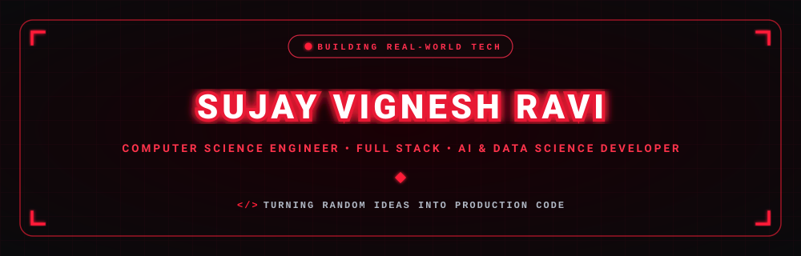

  

  

  
  &nbsp;
  
  &nbsp;
  
  &nbsp;
  

  

---

<h2 align="center">🔴 About Me</h2>

  

  

  Hey! I'm <b>Sujay Vignesh Ravi</b>, a passionate <b>Computer Science Engineering student</b> and developer from India. 
  I enjoy building applications using <b>Java, Python, Full Stack technologies, SQL and Generative AI</b>.

  
  &nbsp;
  
  &nbsp;
  

  🎓 <b>Education:</b> B.E. Computer Science and Engineering 
  🏫 <b>College:</b> K.S. Rangasamy College of Technology 
  💻 <b>Interests:</b> Java, Python, Full Stack Development, AI & Generative AI 
  🚀 <b>Goal:</b> Build useful and impactful software solutions

---

<h2 align="center">🚀 What I'm Working On</h2>

<table width="100%" border="0" align="center">

<tr>
<td width="50%" align="center" style="padding: 14px;">

<h4>🤖 AI Question Paper Generator</h4>

<b>LangChain + Google Gemini + Python</b> 
Automatically generates question papers and answer keys based on course requirements.

</td>

<td width="50%" align="center" style="padding: 14px;">

<h4>📊 NPTEL Performance Dashboard</h4>

<b>Flask + Pandas + NumPy + Chart.js</b> 
Interactive dashboard for analysing student NPTEL performance.

</td>
</tr>

<tr>

<td width="50%" align="center" style="padding: 14px;">

<h4>📚 LMS – Atelier</h4>

<b>React + Node.js + Express + MySQL</b> 
Learning management system for students and faculty.

</td>

<td width="50%" align="center" style="padding: 14px;">

<h4>💡 Continuous Learning</h4>

<b>Java + Python + SQL + AI</b> 
Improving problem solving, development and placement skills.

</td>

</tr>

</table>

---

<h2 align="center">🔴 Featured Project</h2>

<table width="100%" border="0" align="center">

<tr>

<td align="center" style="padding: 22px;">

<h3>🤖 AI Question Paper Generator</h3>

<i>
An AI-powered question paper generation system that uses
LangChain and Google Gemini to automatically generate
questions, answers and difficulty-based question papers.
</i>

</td>

</tr>

</table>

---

<h2 align="center">🧠 Skills</h2>

---

<h2 align="center">🏆 Certifications & Achievements</h2>

🎓 AWS Cloud Practitioner Essentials 
☕ Infosys Springboard – Java Developer Certification 
🐍 Infosys Springboard – Python Programming Fundamentals 
🗄️ Infosys Springboard – DBMS 
🏅 NPTEL Gold – Introduction to Industry 4.0 & IIoT 
🤖 UiPath Automation Developer Associate Training 
☁️ Oracle OCI Foundational Associate 
🚀 Oracle Hack Hub 2025 
🏆 NASSCOM FutureSkills Prime – Digital Engineering GOLD 
🤖 Trailhead #Agentblazer Innovator 2025

---

<h2 align="center">💼 Internship</h2>

<b>Java Full Stack Development Intern</b> 

EduSkills Foundation 

<i>February 2026 – April 2026</i>

---

<h2 align="center">💻 LeetCode Problem Solving</h2>

  <i>Practicing coding, algorithms and problem solving consistently.</i>

---

<h2 align="center">📊 GitHub Analytics</h2>

&nbsp;&nbsp;

---

<h2 align="center">⚡ Contribution Journey</h2>

---

<h2 align="center">📬 Let's Connect</h2>

<i>
Interested in software development, AI, Full Stack development or collaboration?
Feel free to connect with me!
</i>

<table border="0" align="center">

<tr>

<td align="center" width="220" style="padding: 16px;">

<a href="https://www.linkedin.com/in/sujay1810/" target="_blank">

  

</a>

 

<b>Professional Network</b>

</td>

<td align="center" width="220" style="padding: 16px;">

<a href="https://github.com/Sujayvignesh" target="_blank">

  

</a>

 

<b>Projects & Code</b>

</td>

<td align="center" width="220" style="padding: 16px;">

<a href="mailto:sujayvignesh2005@gmail.com">

  

</a>

 

<b>Direct Collaboration</b>

</td>

</tr>

</table>

